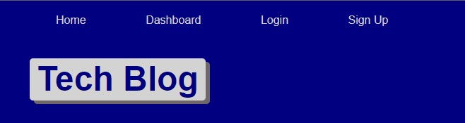

# CW-TechBlog

## Table of Contents 
            
<a href="#description"> 1. Description</a>  

<a href="#install"> 2. Installation </a>

<a href="#usage"> 4. Usage </a></li>

## Description <h1 id='description'> </h1>
          
Your task this week is to build a CMS-style blog site similar to a Wordpress site, where developers can publish their blog posts and comment on other developers’ posts as well. You’ll build this site completely from scratch and deploy it to Heroku. Your app will follow the MVC paradigm in its architectural structure, using Handlebars.js as the templating language, Sequelize as the ORM, and the express-session npm package for authentication.

View Live deployment: https://arcane-sierra-23627.herokuapp.com/
    
## Installation <h1 id='install'></h1>
          
Feel free to fork and adjust to your own needs.
    
## Usage <h1 id='usage'> </h1>
          
Build out any kind of site using this template, doesnt just have to be a tech blog, make it about any topic!

